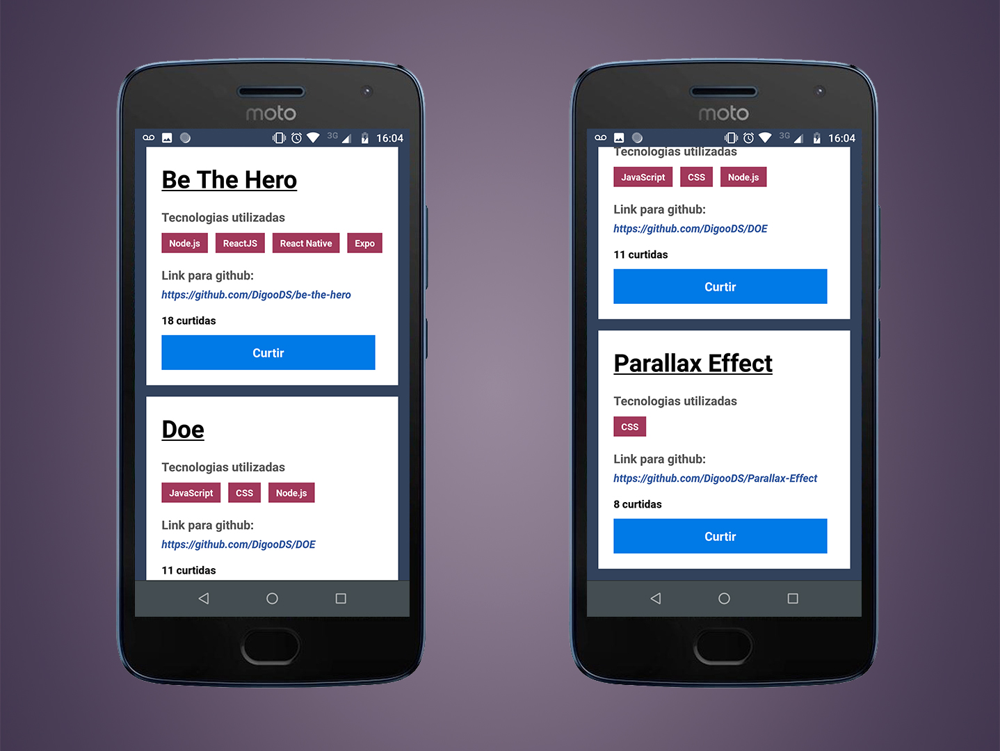

<h1 align="center">
  🚀 GoStack - Desafios Nível 01 🚀
</h1>

<h3 align="center">
Implementação dos desafios do Nível 01 aplicado no Bootcamp GoStack da Rocketseat.
</h3>

<h1 align="center">
  
</h1>

<h1 align="center">
  
</h1>

## Índice

- [Sobre](#-sobre)
- [Tecnologia utilizada](#-tecnologia-utilizada)
- [Objetivos](#-objetivos)
- [Implementação](#-implementação)
- [Para clonar e acessar o projeto](#-para-clonar-e-acessar-o-projeto)
- [Para executar o projeto](#-para-executar-o-projeto)
- [Importante](#-importante)

---

## 🔖 Sobre

Implementação visual dos 3 Desafios propostos pelo bootcamp GoStack da Rocketseat em que o intuito era criar uma aplicação que permite armazenar repositórios do seu portfólio, que permite a criação, listagem e remoção dos repositórios, e além disso que os repositórios também possam receber "likes".

---

## 🚀 Tecnologia utilizada

- [NodeJS](https://nodejs.org/en/)
- [ReactJS](https://reactjs.org)
- [React Native](https://reactnative.dev/)

---

## 🎯 Objetivos

Abaixo seguem os objetivos de cada desafio.

**DESAFIO 1:**
Este desafio consistiu em criar o **back-end** da aplicação que permitem retornar de forma correta as requisições feitas pelo cliente. Para isso foram utilizados os principais métodos HTTP: ***GET***, ***POST***, ***PUT*** e ***DELETE***.

---

**DESAFIO 2:**
Neste desafio foi proposto fazer a ligação do **Front-end** (utilizando o ReactJS) com o **Back-end** (Nodejs) onde os objetivos são:

- **Listar os repositórios da API criada com o Nodejs:**
Deve ser capaz de criar uma lista com o campo "title" de todos os repositórios cadastrados na API.

- **Adicionar um repositório a API:**
Deve ser capaz de adicionar um novo item na API através de um botão com o texto "Adicionar" e, após a criação, deve ser capaz de exibir o nome dele após o cadastro.

- **Remover um repositório da sua API:**
Para cada item da lista, deve possuir um botão com o texto "Remover" que, ao clicar, irá chamar uma função para remover esse item da lista do frontend e da API.

---

**DESAFIO 3:**
Neste desafio foi proposto fazer a ligação do **Mobile** (utilizando o React Native) com o **Back-end** (Nodejs) onde os objetivos são:

- **Listar os repositórios da API criada com o Nodejs:**
Deve ser capaz de criar uma lista de todos os repositórios que estão cadastrados na API com os campos title, techs e número de curtidas seguindo o padrão ${repository.likes} curtidas, apenas alterando o número para ser dinâmico.

- **Curtir um repositório listado da API:**
Deve ser capaz de curtir um item da API através de um botão com o texto Curtir e deve atualizar o número de likes na listagem no mobile.

---

## 🖌 Implementação

O intuito deste repositório é conter os desafios com implementações, para a prática de CSS, ReactJS e React Native. Segue os detalhes das implementações:

- ***Front-end com ReactJS (Desafio 02):*** Aqui foi implementado campos para preenchimento do título, tecnologias e url do repositório. Assim que preenchido e adicionado através do botão adicionar, o repositório é renderizado em tela e armazenado no backend. Caso o usuário tentar adicionar um repositório sem um dos três campos serem preenchidos, um alerta aparece em tela dizendo que todos os campos são obrigatórios preencher além de nada ser armazenado no backend. Teve também implementações visuais para a prática de flexbox com CSS.

- ***Mobile com React Native (Desafio 03):*** Foi implementado a possibilidade de ser renderizado em tela o link do github preenchido pelo usuário.

---

## ⚙ Para clonar e acessar o projeto

```bash
  # clonar o projeto
  $ git clone https://github.com/DigooDS/desafios-nivel01-gostack.git

  # acessar o projeto
  $ cd desafios-nivel01-gostack

```

---

## ⚙ Para executar o projeto

```bash
  # para iniciar o servidor (back-end)
  $ cd backend
  $ yarn dev

  # para iniciar o front-end
  $ cd frontend
  $ yarn start

  # para executar o projeto em um dispositivo móvel (Android)
  $ cd mobile
  $ yarn run react-native run-android

  # executar o projeto em um emulador IOS
  $ cd mobile
  $ react-native run-ios --simulator "nome do dispositivo"

  # executar o projeto em um emulador Android
  $ cd mobile
  $ react-native run-android --simulator "nome do dispositivo"

```

---

## 📌 Importante

Abaixo seguem os links dos repositórios originais, com back-end (conceitos-node.js), front-end (conceitos-reactjs) e mobile (conceitos-react-native) separados para que fosse possível passar pelas correções automatizadas do time da Rockeseat:

**Back-end (Desafio 01):**
https://github.com/DigooDS/conceitos-nodejs

**Front-end (Desafio 02):**
https://github.com/DigooDS/conceitos-reactjs

**Mobile (Desafio 03):**
https://github.com/DigooDS/conceitos-react-native

---
<i>Desenvolvido por RodrigoDS</i> 🤓
